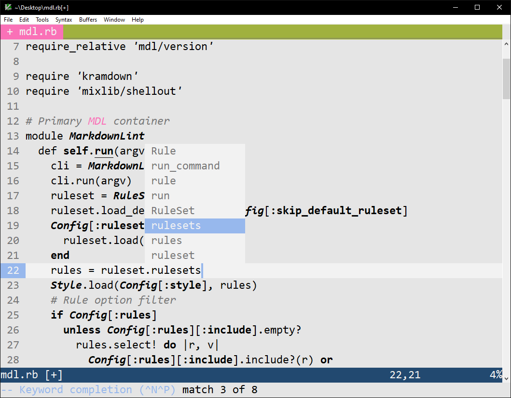

 
A light, super minimal vim color scheme inspired by Bob's Burgers and based on [off](https://github.com/pbrisbin/vim-colors-off)

**Note:** This is very much a WIP

## screenshots



## usage

Install this colour scheme using your preferred method, then place the following line in your Vim configuration.

```vim
colorscheme nopesto
```

## todo

- [ ] more Gene?

## thanks

- [off](https://github.com/pbrisbin/vim-colors-off) and [photon](https://github.com/axvr/photon.vim) for inspiration.
- [tvdb](https://thetvdb.com/) for reference images.
- [vim-css-color](https://github.com/ap/vim-css-color)
- Loren Bouchard. Just in general.

## disclaimer

nopesto is not affiliated with Bob's Burgers or the Fox network ***in any way***
